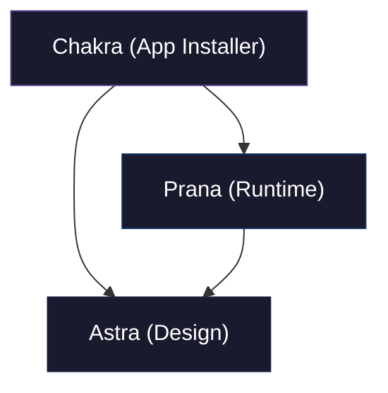

# Chakra

> An Electron-based application for installing and managing other applications via git, with encrypted virtual drive storage.

## Codename Glossary

| Package    | Sanskrit | Meaning              | Scope                                                         |
| ---------- | -------- | ------------------- | -------------------------------------------------------------- |
| **Chakra** | चक्र    | Wheel / Cycle     | This repo — App installer with virtual drive                     |
| **Prana**  | प्राण   | Life Force        | External dependency — Virtual drive, services, runtime              |
| **Astra**  | अस्त्र   | Divine Instrument | External dependency — Design system, UI components               |

## Architectural Philosophy

Chakra is built around four core principles:

1. **Git-Based Installation** — All applications are installed from git repositories to specific folders within the encrypted virtual drive
2. **Encrypted Virtual Drive** — All data (installed apps, governance repos, cache) is stored in an encrypted mount
3. **Role-Based Governance** — SSH access to governance repos is role-based with proper security
4. **SQLite Caching** — Login credentials, environment configuration, and external data (Google Sheets) are cached locally

## Dependency Graph



> **Rule**: Chakra consumes external dependencies (`prana`, `astra`) and keeps app-specific logic local.

## System Architecture

```
┌─────────────────────────────────────────────────────────────────────┐
│                        CHAKRA APPLICATION                    │
│                 Mounted Encrypted Virtual Drive                 │
└──────────────────────────────┬──────────────────────────────────────┘
                               │
┌──────────────────────────────▼──────────────────────────────────────┐
│                       MAIN PROCESS                          │
│  ┌──────────────┐  ┌──────────────┐  ┌────────────────────┐ │
│  │  App        │  │   Git       │  │  SSH Governance    │ │
│  │  Registry   │  │  Installer │  │  Service           │ │
│  └──────┬─────┘  └──────┬─────┘  └─────────┬──────────┘ │
│         │               │                  │             │
│  ┌──────▼──────────────▼──────────────────▼──────────┐ │
│  │              PRANA SERVICES                        │ │
│  │  driveController · vault · SQLite Cache           │ │
│  │  googleSheetsCache · authService                │ │
│  └────────────────────────────────────────────────┘ │
└──────────────────────────────┬──────────────────────────────────────┘
                               │ IPC
┌──────────────────────────────▼──────────────────────────────────────┐
│                    RENDERER (React/MUI)                      │
│  App List · Installation · Governance · Settings          │
│  (Uses Astra components: Card, DataTable, Notification)     │
└─────────────────────────────────────────────────────────────┘
```

## Virtual Drive Structure

When the virtual drive is mounted, Chakra organizes data as:

```
/mounted-drive/
├── app/                    # Installed applications
│   ├── dhi/              # Dhi app (installed via git)
│   └── {appName}/        # Other installed apps
├── data/
│   └── governance/       # Governance repositories
│       └── {repoName}/   # SSH-accessible governance repos
└── cache/
    └── chakra.sqlite    # SQLite cache
        ├── login       # Login credentials
        ├── config     # Environment configuration
        └── sheets    # Google Sheets cached data
```

## Features

| Feature | Description | Status |
|---------|-------------|--------|
| **App Installation** | Install apps from git repositories | ✅ |
| **App Uninstallation** | Clean removal of installed apps | ✅ |
| **App Listing** | List apps with role-based filtering | ✅ |
| **App Updates** | Check and apply app updates | ✅ |
| **Configuration** | Min version, app-specific config | ✅ |
| **SSH Governance** | Role-based SSH access | ✅ |
| **Virtual Drive** | Encrypted mount storage | ✅ |
| **SQLite Cache** | Login, config, Google Sheets | ✅ |
| **Google Sheets** | Cache external data | ✅ |

## Security Model

| Layer | Mechanism | Description |
|------|-----------|-------------|
| **Virtual Drive** | AES-256 encryption | Encrypted via Prana vault |
| **Login** | Local authentication | Required before drive access |
| **SSH** | Role-based access | Governance repos per role |
| **Google Sheets** | OAuth + cache | Cached in SQLite |

## Getting Started

### Prerequisites

- Node.js 18+
- npm or yarn
- Git

### Installation

```bash
# Clone the repository
git clone https://github.com/NikhilVijayakumar/chakra.git
cd chakra

# Install dependencies
npm install

# Run in development mode
npm run dev
```

### Building

```bash
# Build for Windows
npm run build:win

# Build for macOS
npm run build:mac

# Build for Linux
npm run build:linux
```

### Scripts

| Script | Description |
|-------|-------------|
| `npm run dev` | Start Electron in dev mode |
| `npm run build` | Build for distribution |
| `npm run build:win` | Build Windows installer |
| `npm run generate:index` | Generate docs/index.md |

## Documentation

| Document | Description |
|----------|-------------|
| [docs/index.md](docs/index.md) | In-depth documentation index |
| [docs/feature/installation/](docs/feature/installation/) | App installation docs |
| [docs/feature/governance/](docs/feature/governance/) | SSH governance docs |
| [docs/feature/storage/](docs/feature/storage/) | Storage & cache docs |

## Project Structure

```
chakra/
├── src/
│   ├── main/                    # Electron main process
│   │   ├── index.ts           # Main entry point
│   │   ├── preload.ts        # Preload scripts
│   │   └── services/        # Runtime services
│   └── renderer/               # React renderer
│       ├── main.tsx          # Renderer entry
│       └── common/
│           └── components/   # UI components (Astra)
├── docs/
│   ├── feature/             # Feature documentation
│   │   ├── installation/
│   │   ├── governance/
│   │   ├── storage/
│   │   └── virtual-drive/
│   └── index.md             # In-depth index (auto-generated)
├── scripts/
│   ├── generate-index.cjs  # Index generator
│   └── wiki-steps.json      # Documentation config
├── package.json            # Dependencies
└── README.md              # This file
```

## Integration with Dhi

Chakra can install Dhi as an application:

```bash
# Install Dhi via Chakra
# (Once Dhi is added to Chakra's app registry)
chakra install dhi --repo https://github.com/NikhilVijayakumar/dhi
```

Dhi will be installed to:
```
/mounted-drive/app/dhi/
```

## License

MIT